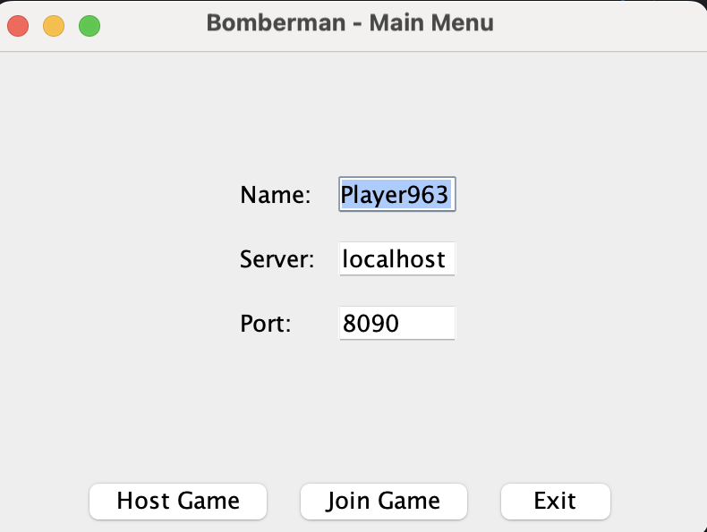
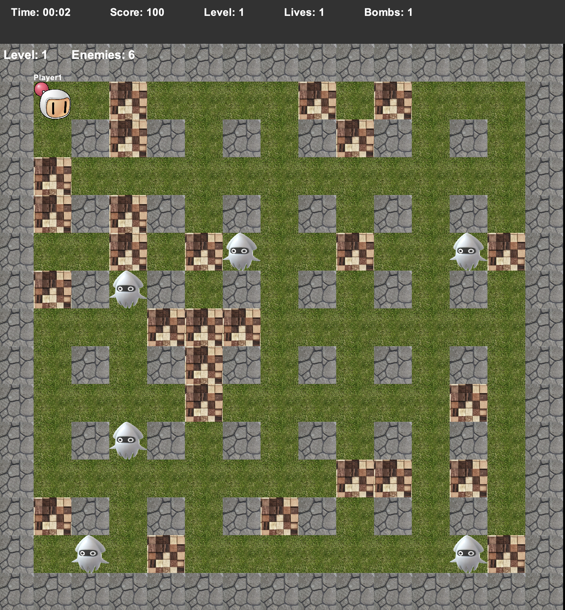
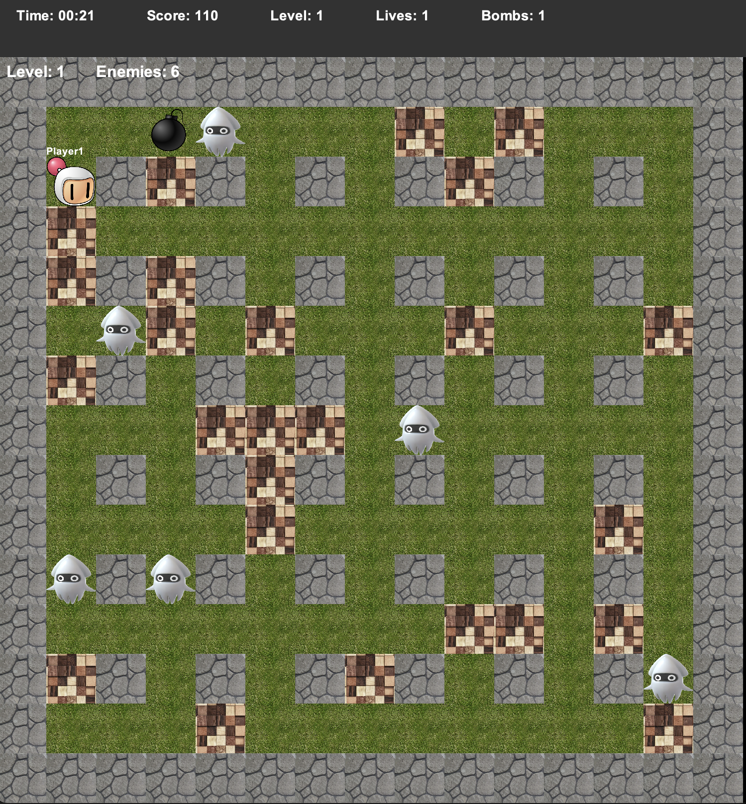

# Bomberman Multiplayer Game

A Java-based multiplayer implementation of the classic Bomberman game featuring network play, AI enemies, and a comprehensive power-up system.


## 📋 Table of Contents
- [Features](#features)
- [Screenshots](#screenshots)
- [Architecture](#architecture)
- [Installation](#installation)
- [How to Play](#how-to-play)
- [Game Mechanics](#game-mechanics)
- [Technical Details](#technical-details)
- [Project Structure](#project-structure)
- [Contributing](#contributing)
- [Future Enhancements](#future-enhancements)
- [License](#license)

## ✨ Features

### Core Gameplay
- **Classic Bomberman mechanics** with modern improvements
- **Progressive difficulty system** with 4 levels
- **Dynamic maze generation** ensuring path accessibility
- **Real-time explosion effects** with chain reactions
- **Collision detection** for walls, enemies, and players

### Multiplayer Support
- **Host/Join system** for network play
- **Multiple concurrent players** support
- **Synchronized game state** across clients
- **Custom networking protocol** for real-time updates

### Enemy AI System
- **4 unique enemy types** with different behaviors:
    - **Enemy 1 (Green)**: Random movement pattern
    - **Enemy 2 (Blue)**: Semi-intelligent, occasionally tracks players
    - **Enemy 3 (Red)**: Fast and aggressive, actively hunts players
    - **Enemy 4 (Purple)**: Ghost enemy, can pass through walls

### Power-Up System
- **Bomb Capacity**: Increase/decrease maximum bombs
- **Speed Boost**: Modify movement speed
- **Explosion Radius**: Expand bomb blast range
- **Ghost Mode**: Temporarily walk through walls
- **Remote Control**: Detonate bombs on command
- **Score Modifiers**: Bonus points and penalties
- **Level Door**: Progress to next level after defeating all enemies

## 📸 Screenshots





## 🏗️ Architecture

### Design Patterns
- **MVC Pattern**: Separation of game logic, UI, and models
- **Observer Pattern**: Event-driven updates
- **Factory Pattern**: Enemy and booster creation
- **Singleton Pattern**: Resource management

### Thread Safety
- Concurrent collections for multiplayer synchronization
- Thread-safe game state management
- Separate threads for:
    - Game logic updates
    - Network communication
    - UI rendering
    - Enemy AI calculations

## 🚀 Installation

### Prerequisites
- Java 8 or higher
- IntelliJ IDEA (recommended) or any Java IDE

### Setup Instructions

1. **Clone the repository**
```
git clone https://github.com/yourusername/bomberman.git
cd bomberman
```
2. **Open in IntelliJ IDEA**

```
File → Open → Select the Bomberman folder
```
IntelliJ should automatically detect the project structure


3. ***Build the project***
```
javac -d out -sourcepath src/main/java src/main/java/com/bomberman/Main.java
```
4.Run the game
```
java -cp out com.bomberman.Main
```


## 🎮 How to Play
### Controls
Key | Action 
↑ ↓ ← →| Move player
B | Place bomb
SPACE | Detonate bomb (with remote control power-up)
ESC | Return to menu
### Starting a Game
#### Host a Game

1. Click "Host Game"
2. Enter your player name
3. The server starts on port 8090
4. Share your IP with other players

#### Join a Game

1. Click "Join Game"
2. Enter server address
3. Enter port number (default: 8090)
4. Enter your player name

#### Objective

1. Navigate the maze and destroy breakable walls
2. Defeat all enemies on each level
3. Collect power-ups to enhance abilities
4. Find and reach the door after clearing enemies
5. Progress through all 4 levels to win

### 🎯 Game Mechanics
#### Bomb Mechanics

- Bombs explode after 3 seconds
- Explosion spreads in 4 directions
- Chain reactions possible with multiple bombs
- Explosion radius affected by power-ups

#### Scoring System

- Wall destruction: 10 points 
- Enemy defeat: 100 × enemy type 
- Power-up collection: Varies 
- Time penalties for slow completion

#### Level Progression

- Level 1: Only basic enemies (Enemy Type 1)
- Level 2: Enemy Types 1-2
- Level 3: Enemy Types 1-3
- Level 4: All enemy types including ghosts

### 💻 Technical Details
#### Technologies Used

- Language: Java 8+
- GUI Framework: Swing
- Networking: Java Sockets
- Concurrency: java.util.concurrent
- Build System: Manual compilation (Maven compatible)

#### Key Classes

- Game.java: Core game logic and state management
- MapPanel.java: Rendering and display
- Client.java / Server.java: Network communication
- Enemy.java: Base enemy AI behavior
- Bomberman.java: Player character logic

## 📁 Project Structure

Bomberman/
├── src/
│   ├── main/
│   │   ├── java/
│   │   │   └── com/bomberman/
│   │   │       ├── Main.java
│   │   │       ├── constants/
│   │   │       ├── models/
│   │   │       │   ├── enemies/
│   │   │       │   ├── boosters/
│   │   │       │   └── terrain/
│   │   │       ├── game/
│   │   │       ├── ui/
│   │   │       ├── network/
│   │   │       └── utils/
│   │   └── resources/
│   │       └── images/
│   └── test/
├── out/
└── README.md
## 🤝 Contributing
Contributions are welcome! Please follow these steps:

- Fork the repository
- Create a feature branch (git checkout -b feature/AmazingFeature)
- Commit your changes (git commit -m 'Add some AmazingFeature')
- Push to the branch (git push origin feature/AmazingFeature)
- Open a Pull Request

## 🔮 Future Enhancements

- Sound effects and background music
- Save/Load game functionality
- Player statistics and leaderboard
- Custom map editor
- Spectator mode
- Additional power-ups and enemy types
- AI difficulty settings
- Tournament mode
- Cross-platform executable packaging

[//]: # (## 📄 License)

[//]: # (This project is licensed under the MIT License - see the LICENSE file for details.)

## 👤 Author
Andisheh Ghasemi

Website: andishehghasemi.com
GitHub: @andisheghs

## 🙏 Acknowledgments

Original Bomberman game by Hudson Soft
Java Swing documentation and community
Contributors and testers


Built with ❤️ as part of my portfolio of interactive projects
